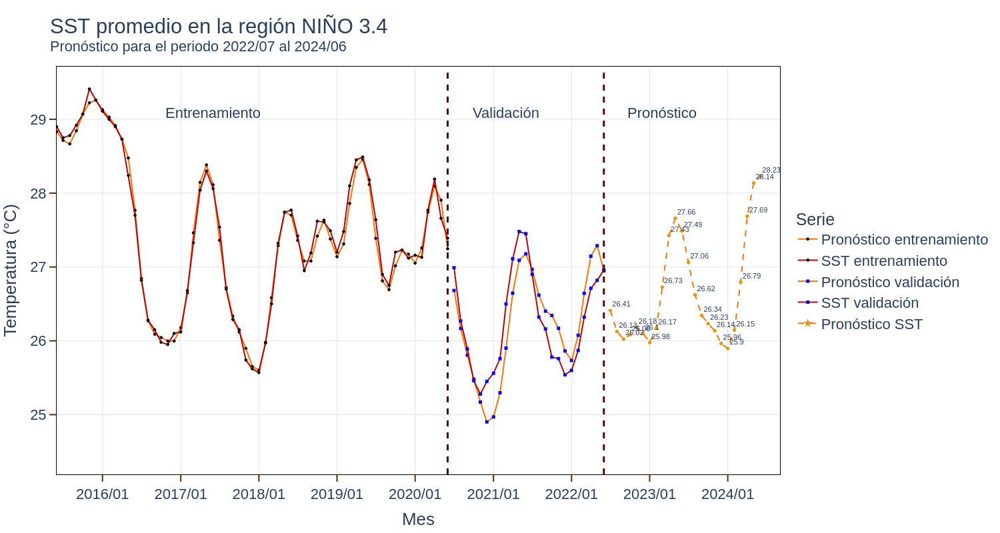
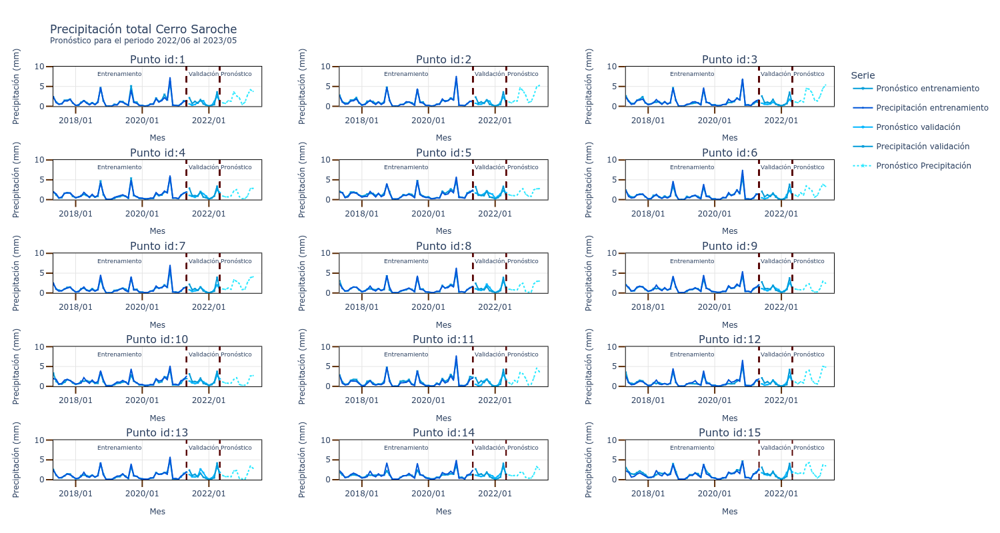
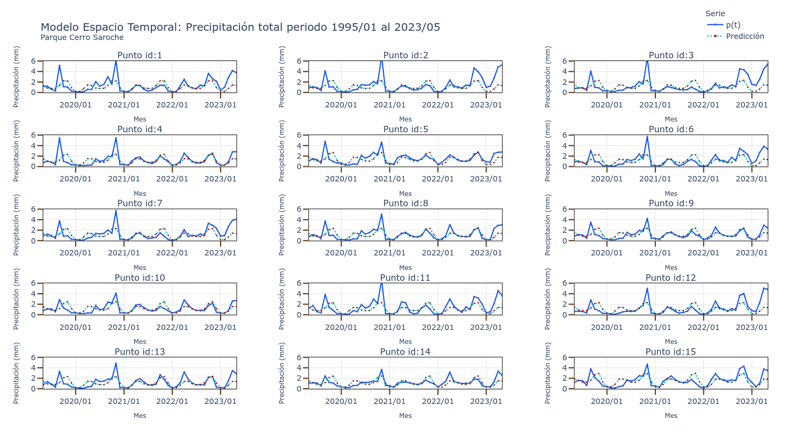
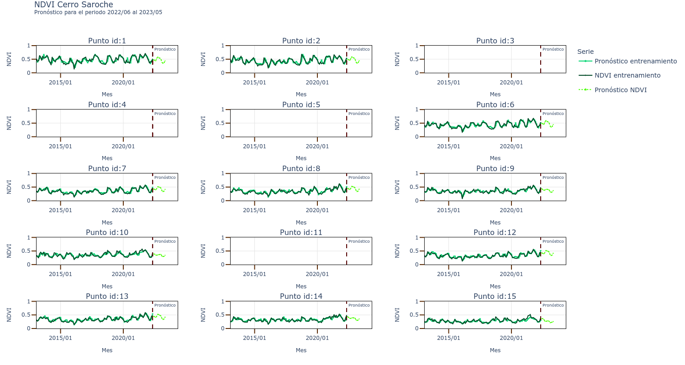
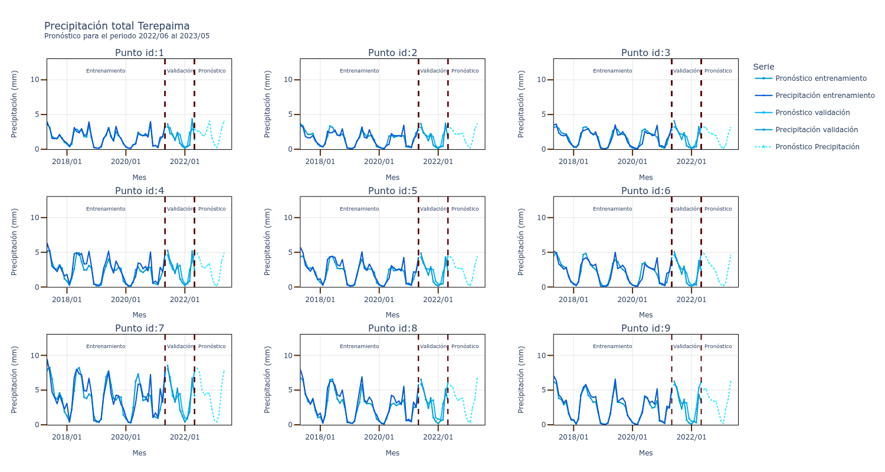

# Sistema para el Seguimiento de Ecosistemas Venezolanos (SSEV)

**Autor:** [Javier Martínez](https://esglobe.github.io/)

## Análisis de datos y Machine Learning

### Inicio del proyecto

Primeramente, se recomienda generar el environment del proyecto utilizando:

1. Instalar miniconda [Página](https://docs.conda.io/en/latest/miniconda.html)
2. En terminal
 ~~~
conda env create -f ./environment.yml
conda activate ssev_analytics
conda env update --file ./environment.yml --prune
~~~

Posteriormenmte, es necesario la creación de un archivo **config.yml** que disponga de las siguientes variables para iniciar sesión en la NASA, Copernicus y MongoDb:

~~~
NASA_USER: <Usuario API NASA>
NASA_PASSWORD: <Credencial NASA>
NASA_TOKEN: <Token API NASA>
MONGO_USER: <Nombre del usuario MongoDB>
MONGO_PASSWORD: <Credenciales de usuario MongoDB>
MONGO_CLUSTER: <Cluster MongoDB>
~~~

### Módulos Python

En el directorio **./ssev-analytics** se realiza el análisis de datos y entrenamiento de redes neuronales con el fin de predecir la variación espacio-temporal del NDVI de los parques nacionales Cerro Saroche y Terepaima.  La estructura diseñada es:

~~~
 ├─ ssev-analytics
     └─ cerro_saroche
     └─ sst_nino34
     └─ terepaima
     └─ utils
~~~

Donde *cerro_saroche*, *sst_nino34* y  *terepaima* contienen los estudios y resultados del entrenamiento de redes neuronales para la variación espacio-temporal del NDVI de los parques Cerro Saroche, Terepaima y la variación temporal de la temperatura promedio en la superficie del mar (SST) en la región El Niño3.4. 

## Variación temporal de la temperatura promedio en la superficie del mar (SST) en la región El Niño 3.4

Los procesos desarrollados para el tratamiento de la información rorrespondientes al parque Cerro Saroche estan disponibles en **/sst_nino34/**:

1. [Análisis de datos](./sst_nino34/1_analisis_sst_nino34.ipynb).
2. [RNN variación temporal de SST en la región Nino 3.4](./sst_nino34/2_experimento_rnn_sst.ipynb).
3. [Pronóstico del ONI](./sst_nino34/3_forecast_oni_rnn_sst.ipynb).

#### Pronóstico SST región El Nino 3.4

#### Índicer Nino Oceánico (ONI)

#### Pronóstico del ONI

### Variación espacio-temporal del NDVI en el Parque Nacional Cerro Saroche

Los procesos desarrollados para el tratamiento de la información correspondientes al parque Cerro Saroche están disponibles en **/cerro_saroche/**:

1. [NARX precipitación](./cerro_saroche/1_precipitacion_narx.ipynb).
2. [Análisis de resultados NARX precipitación](./cerro_saroche/2_narx_precipitacion_analysis.ipynb).
3. [ANN variación espacial de la precipitación](./cerro_saroche/3_ann_precipitacion.ipynb).
4. [Análisis de resultados ANN](./cerro_saroche/4_ann_precipitacion_analysis.ipynb).
5. [NARX variación espacio-temporal NDVI](./cerro_saroche/5_narx_ndvi_analysis.ipynb).
6. [Inserción de datos en MongoDB](./cerro_saroche/6_mongo_insercion.ipynb).

#### Precipitación total (mm)

#### NARX variación temporal de la precipitación total

#### ANN variación espacial de la precipitación total

#### NARX variación espacio-temporal del NDVI

### Variación espacio-temporal del NDVI en el Parque Nacional Terepaima

Los procesos desarrollados para el tratamiento de la información correspondientes al parque Terepaima están disponibles en **/terepaima/**:

1. [NARX precipitación](./terepaima/1_precipitacion_narx.ipynb).
2. [Análisis de resultados NARX precipitación](./terepaima/2_narx_precipitacion_analysis.ipynb).
3. [ANN variación espacial de la precipitación](./terepaima/3_ann_precipitacion.ipynb).
4. [Análisis de resultados ANN](./terepaima/4_ann_precipitacion_analysis.ipynb).
5. [NARX variación espacio-temporal NDVI](./terepaima/5_narx_ndvi_analysis.ipynb).
6. [Inserción de datos en MongoDB](./terepaima/6_mongo_insercion.ipynb).

#### Precipitación total (mm)

#### NARX variación temporal de la precipitación total

#### ANN variación espacial de la precipitación total

#### NARX variación espacio-temporal del NDVI

